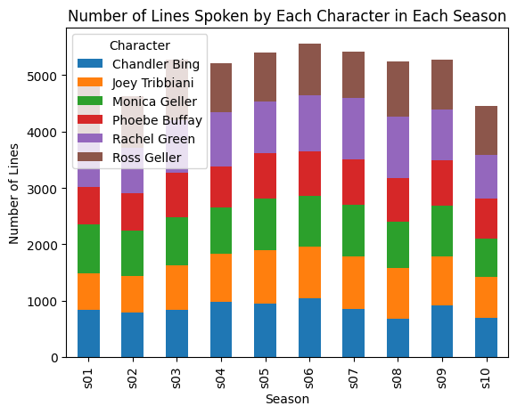
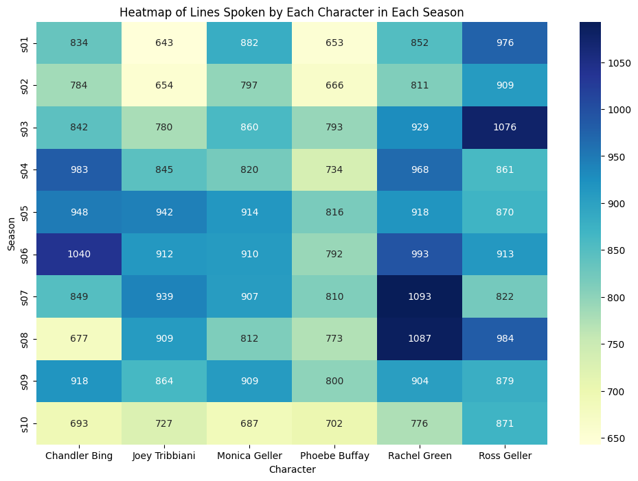

## Overview

This project analyzes the dialogue data from a fictional dataset, focusing on the main characters' spoken lines across different seasons. It involves loading the data, filtering by specific criteria, performing statistical tests, and visualizing the results.

## Structure

The project is structured into four main files:

- `main.py`: Orchestrates the data loading, processing, analysis, and visualization steps.
- `data_processing.py`: Contains functions to load the data from a JSON file, filter the data for specific characters, extract season information, and create a contingency table.
- `analysis.py`: Includes statistical analysis functions, specifically performing a Chi-Squared test on the contingency table.
- `visualization.py`: Responsible for visualizing the data using bar charts and heatmaps.

## Installation

To run this project, you need to install the necessary Python packages. You can install them using the following command:

```bash
pip install -r requirements.txt
```

## Requirements File

Create a requirements.txt file with the following contents to manage the dependencies:

```bash
pandas
scipy
matplotlib
seaborn
```

## Usage

Run the project by executing the main.py script.

This will produce plots showing the number of lines spoken by each character per season and a heatmap representing the same data.





